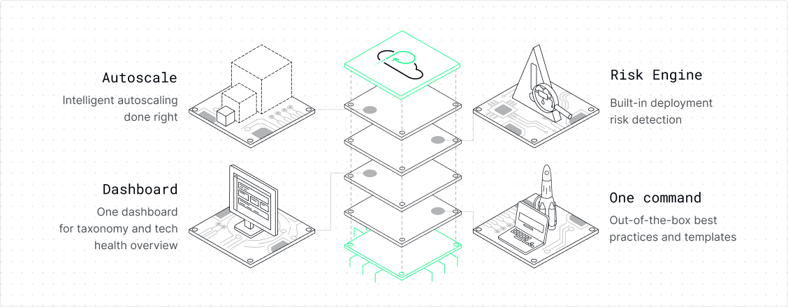

# Hi 👋 Welcome to the Platformatic community!

Platformatic’s Open Source toolkit helps you build modern Node.js applications without the endless loop of setup and maintenance. 

Break free from repetitive tasks, accelerate deployments and improve your Node.js development experience with our:

- Opinionated structures and composable templates
- Batteries-included API setup
- Out-of-the-box documentation, logs and metrics
- Shareable and reusable configurations

## Platformatic for Teams

 Node.js promises speed, agility, and scalability. In practice however, doing Node right has been a challenge for engineering teams, costing their companies cloud spend, downtime, and time-to-market. 

 Time and time again, we’ve seen companies stumble when dealing with the same 5 issues: 

- Scaling based on CPU and memory.
- Preview environment limitations
- Getting the right Node.js metrics
- Not knowing what will break or which teams you’ll impact when deploying APIs
- Figuring out which logger is right for you

**Platformatic’s Command Center solves Node.js for enterprise teams.**

Bring your legacy Node.js applications. Improve performance, eliminate downtime, and cut development costs without a rewrite—in one unified platform.

The Command Center allows you to:

- Streamline your deployment process
- Minimize downtime and increase reliability
- Manage your Node applications in one place
- Intelligently autoscale based on Node performance metrics

__Explore [PlatformaticHQ.com](https://www.platformatichq.com/) to find out more about the Command Center.__

## 👬 Community

- [Discord channel](https://discord.com/channels/1011258196905689118/1011258204371554307) for feedback, queries, learning resources and masterclasses
- [Contributor code of conduct](https://github.com/platformatic/.github/blob/main/CODE_OF_CONDUCT.md) 

## 📚 Useful resources

- [Quick Start guide](https://docs.platformatic.dev/docs/getting-started/quick-start-guide)
- [Beginner tutorial: Build a Todo API with Platformatic DB](https://docs.platformatic.dev/docs/learn/beginner/crud-application)
- [Advanced guides](https://docs.platformatic.dev/docs/guides/movie-quotes-app-tutorial)
- [Masterclasses](https://www.youtube.com/playlist?list=PL_x4nRdxj60K2j9l_SflmqmaTA2XVBuqc)
- [Blog](https://blog.platformatic.dev)
